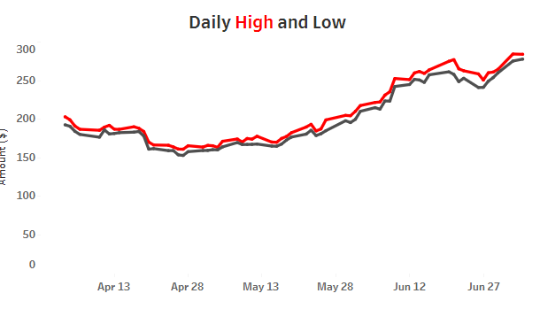
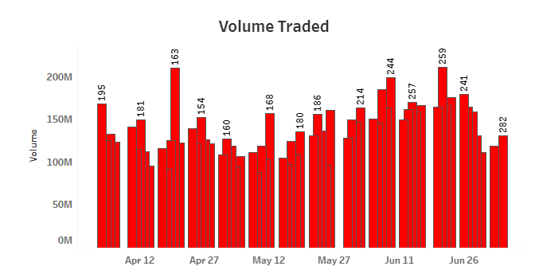
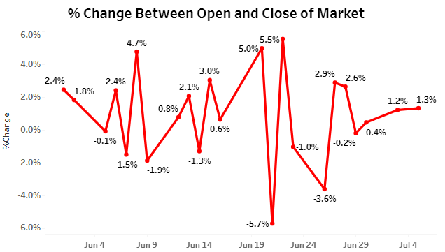

# Tesla-Stock-Analysis-Dashboard

This repository contains the code and data for performing analysis on Test Stock and creating an interactive dashboard to visualize the insights. The stock data has been scraped using Python from a reliable source and is utilized to generate various visualizations and metrics.

## Table of Contents

1. [Introduction](#introduction)
2. [Data Collection](#data-collection)
3. [Data Analysis](#data-analysis)
4. [Dashboard](#dashboard)
5. [Accessing the Dashboard](#accessing-the-dashboard)
6. [Full Dashboard Preview](#full-dashboard-preview)
7. [Filter Functionality](#filter-functionality)
8. [Graph Descriptions](#graph-descriptions)
9. [Contributing](#contributing)

## Introduction

The goal of this project is to analyze the performance of Test Stock over the last few months and present the findings in an easily interpretable dashboard. The dashboard comprises four interactive graphs showing different aspects of the stock's behavior, along with a filter that allows users to select the time duration they want to view.

## Data Collection

The stock data for Test Stock has been collected by scraping a reliable financial data website using Python. The data includes daily close prices, high and low prices, traded volume, and open-close changes for each trading day.

## Data Analysis

The collected data is analyzed to compute the highest price, lowest price, and the average closing price for the last 3 months. These metrics are displayed in the dashboard for quick reference.

## Dashboard

The dashboard provides an interactive interface to visualize the stock's performance. It contains the following elements:

1. Graph 1: Daily Close Price - A line plot showing the daily close price of Test Stock.
2. Graph 2: Daily High and Low Prices - A candlestick chart displaying the daily high and low prices of the stock.
3. Graph 3: Volume Traded - A bar chart indicating the traded volume for each trading day.
4. Graph 4: Open-Close Change - A bar chart showcasing the change between the open and close prices on a specific date.

## Accessing the Dashboard

You can access the interactive dashboard on Tableau Public by clicking [here](https://public.tableau.com/shared/DXDS8QQ64?:display_count=n&:origin=viz_share_link).

## Full Dashboard Preview

Below is a preview of the interactive dashboard:

## Filter Functionality

The dashboard includes a filter that enables users to select specific time durations to analyze. The available filter options are "Last 1 month," "Last 2 months," "Last 5 months," and so on. When a filter option is chosen, the graphs will automatically update to display the data for the selected period.

## Graph Descriptions

1. Graph 1: Daily Close Price
   
   This line plot shows the daily closing prices of Test Stock over the selected time duration. It helps visualize the overall trend of the stock.

2. Graph 2: Daily High and Low Prices
   
   The candlestick chart illustrates the daily high and low prices of the stock over the chosen period, giving insights into price fluctuations.

3. Graph 3: Volume Traded
   
   The bar chart represents the volume of stock traded on each trading day during the selected time range, providing an overview of trading activity.

4. Graph 4: Open-Close Change
   
   This bar chart showcases the difference between the opening and closing prices of the stock on a specific date. It helps identify days with significant price changes.

## Contributing
Contributions to this project are welcome. If you find any bugs or have suggestions for improvements, please open an issue or submit a pull request.
